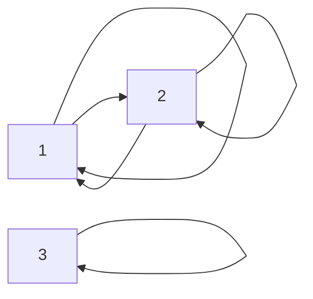

Отношение эквивалентности.

Отн. сравним. по модулю $A = \mathbb{Z}, \ \ x, y \in \mathbb{Z}$

$R \subseteq A \times A$ – б. отн. на $A$ 

$$\displaylines{
x \equiv y \text{ (mod n)} \Leftrightarrow x \equiv_{ n } y \Leftrightarrow (x - y) \ \ \vdots \ \ n \Leftrightarrow n \mid (x - y)
}$$

$x$ сравнимо с $y$ по модулю $n \in \mathbb{N}$ 

Примеры: 
$$\displaylines{
15 \equiv_{ 2 } 5 \\ 
13 \equiv_{ 7 } -1  \\ 
x \equiv_{ n } x 
}$$

Симметрия 
$$\displaylines{
x \equiv_{ n } y \implies y \equiv_{ n } x \Leftrightarrow x - y = n \cdot a \implies y - x = n \cdot (- a), \ \ a \in \mathbb{Z}
}$$

Транзитивность 
$$\displaylines{
\begin{matrix}
x \equiv_{ n } y  \\
y \equiv_{ n } z
\end{matrix} \implies  x \equiv_{ n } z \\ 
\begin{matrix}
x \equiv_{ n } y  \\
+ \\
y - z = n \cdot b \\
\overline{ \text{           } } \\
x - z = n \cdot (a + b)
\end{matrix}
}$$

$$\displaylines{
A = \mathbb{Z} \times \mathbb{N} \\ 
(m, n) \sim (p, g) \Leftrightarrow m \cdot q = n \cdot p \left( \frac{m}{n} = \frac{p}{q} \right) \\ 
}$$
Упр. проверить, что $\sim$ – отн. эквива. 

Определение: Разбиение мн-ва $A$ – это такое семейство его непустых подмн., что $\forall$ эл-т из $A$ принадлежит ровно одному подмножеству этого семейства. Подмножество семейство – это часть разбиения. 

Пусть $A$ – конечно. 
$$\displaylines{
F = \{ F_{ 1 }, F_{ 2 }, \dots, F_{ k } \} \text{ – F разбиение А} \\ 
1. \ \ F_{ i } \subseteq A \text{ and } F_{ i } \neq \emptyset \\ 
2. \ \ A = F_{ 1 } \cup F_{ 2 } \cup \dots \cup F_{ k } \\ 
3. \ \ F_{ i } \cap F_{ j } = \emptyset, \ \ i \neq j
}$$

Пример: 
$$\displaylines{
A = \{ 1, 2, 3 \} \\ 
F = \{ \{ 1, 2 \}, \{ 3 \} \}
}$$

Если выполняется второе и третие свойство, то можно записать кратче: 
$$\displaylines{
A = F_{ 1 } \sqcup F_{ 2 } \sqcup \dots \sqcup F_{ k } 
}$$

Пример: 
$$\displaylines{
\{ 1, 2, 3 \} = \{ 1, 2 \} \sqcup \{ 3 \} = \{ 1 \} \sqcup \{ 2 \} \sqcup \{ 3 \}
}$$

Любое разбиение задает отношение экв. на множестве. Пусть $F$ – разбиение множетсва $A$ (любое), тогда $F$ задает отношение экв. $\sim_{ F }$ на $A$ 
$$\displaylines{
x \sim_{ F } y \Leftrightarrow^{ \text{def} } \text{x и y лежат в одной части разбиения}
}$$

Выполнение транзитивности: 
$$\displaylines{
\begin{matrix}
x \sim_{ F } y  \\
y \sim_{ F } z 
\end{matrix} \implies x \sim_{ F } z \\ 
\sim \text{ – отношение экв.}
}$$

Пример: 
$$\displaylines{
A = \{ 1, 2, 3 \} \\ 
F = \{ \{ 1, 2 \}, \{ 3 \} \} \\ 
\sim_{ F } = \{ (1, 2), (2, 1), (1, 1), (2, 2), (3, 3) \}
}$$

Пусть $\sim$ – отн. экв. на множестве $A$. Тогда оно задает разбиение $F$ множества $A$. Как? 
$$\displaylines{
x \in A  \\ 
[x] = \{ y \in A \mid x \sim y \} \text{ класс экв. элемента x} \\ 
x \sim x \implies x \in [x] \neq \emptyset \text{ класс экв. для люб. x не пуст} \\ 
[x] = \{ y \in A \mid y \sim x \} \text{ следует из симметричности } \sim \\ 
}$$

Утв. $y \in [x] \implies [y] = [x]$. Класс не зависит от представителя. 

Доказательство: $y \in [x] \implies [y] = [x]$, берем $\forall a \in [y] \implies^{ \text{def} } a \sim y$, дано $y \in [x] \implies y \sim x \implies$ транзитивность, $a \sim x \implies$ $a \in [x]$ 

$[y] \subseteq [x]$ – доказали 

Обратно: Берем $\forall a \in [x] \implies a \sim x$, дано $y \sim x \implies x \sim y \implies a \sim y \implies a \in [y]$ доказали обратное включение $[x] \subseteq [y]$ 

Тогда $[x] = [y]$

Следствие утв.: $\forall x, y \in A$ имеет место альтернатива: либо $[x] = [y]$, либо $[x] \cap [y] = \emptyset$

Доказательство: Если пусто, то нечего доказывать. Если пересекаются, то $[x] \cap [y] \neq \emptyset \implies \exists z \in A, z \in [x], z \in [y] \implies [z] = [x], [z]= [y]$ 

Теорема о Факторизации: Пусть $\sim$ – отношение экв. на $A$. Тогда мн-во $F =\{ [x] \mid x \in A \}$ – тогда такое мн-во – разбиение множества $A$. При этом $F$ наз. фактор множетсвом мн. $A$ по отношению $\sim$ и обозначается $F = A/\sim$. 

Док-во по определению (разбиение мн-ва $A$): 
1. $[x] \neq \emptyset \ \ \forall x \in A \ \ x \subseteq A$ 
2. ...
$$\displaylines{
\begin{matrix}
\forall x \in A \ \ x \in [x] \\
\text{Если } x \in [y] 
\end{matrix} \implies [x] = [y]
}$$

Пример: 
$$\displaylines{
\equiv_{ n } \text{ на } \mathbb{Z} \\ 
x \in \mathbb{Z} \\ 
[x] = \{ y \in \mathbb{Z} \mid \underset{ (x - y) \ \ \vdots \ \ n }{ x \equiv_{ n } y } \} \\
x = n \cdot q + r \\ 
r \in \{ 0,1 \dots, n - 1 \} \\ 
x - r = n \cdot q \ \ \vdots \ \ n \\ 
r \in [x] \implies [x] = [r]
}$$
Классов – конечное кол-во. 
$$\displaylines{
\mathbb{Z}/\equiv_{ n } = \underset{ \text{n разных классов} }{ \{ [0], [1], [2], \dots, [n - 1] \} } \\ 
\mathbb{Z}/n\mathbb{Z} \text{ обозначение в алгебре}
}$$

Пример: 
$$\displaylines{
\mathbb{Z}/\equiv_{ 2 } = \{ \underset{ \text{even} }{ [0] }, \underset{ \text{odd} }{ [1] } \} \\ 
}$$

Пример: 
$$\displaylines{
A = \mathbb{Z} \\ 
x \sim y \Leftrightarrow x^{2} = y^{2}A \\ 
[x] = \{ x, -x \}, x \neq 0 \\ 
[0] = \{ 0 \} \\ 
\mathbb{Z}/\sim =\{ \{ 0 \}, \{ 1, -1 \}, \{ 2, -2 \}, \dots \}
}$$

Пример: 
$$\displaylines{
A = \mathbb{Z} \times \mathbb{N} \\ 
(m, n) \sim (p, q) \stackrel{ \text{def} }{ \Leftrightarrow } m \cdot q = n \cdot p \\ 
\left[ \underset{ \frac{m}{1} }{ (m, 1) } \right] = \{ (m \cdot q, q) \mid q \in \mathbb{N} \} \text{ or } \frac{mq}{q} = \frac{m}{1} \\ 
\mathbb{Q} = \mathbb{Z} \times \mathbb{N}/\sim  \\ 
[(-3, 2)] = -\frac{3}{2} \\ 
(-6, 4) \in [(-3, 2)]
}$$
Отношение порядка: $R \subseteq A \times A$ – отн. порядка (порядок), если $R$ – рефл., анти-симмитр., транзитивно. 

Если $R$ – это порядок, то $(A, R)$ – упорядоченное мн-во. 

Пример: 
1. $\leq, \geq$ на $\mathbb{N}, \mathbb{Z}, \mathbb{Q}, \mathbb{R}$ 
2. Отношение делимости $\mid$ на $\mathbb{N}$
3. Отношение включения на $2^{ U }$ 

Пусть $R$ – порядок на $A$, если $xRy$ – говорят $x$ предшетствует $y$ или $x$ не превосходит $y$. 

$x, y$ сравнимы, если $xRy$ или $yRx$ 