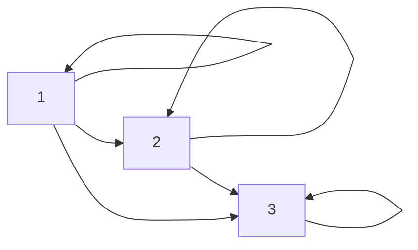
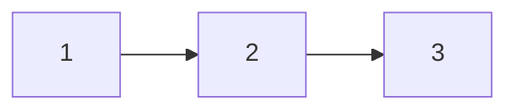
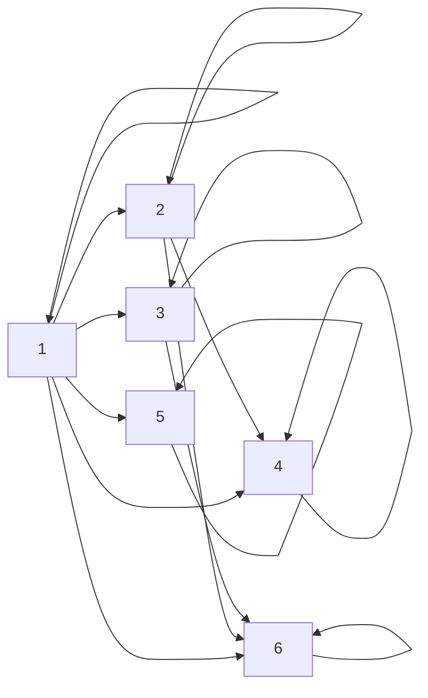
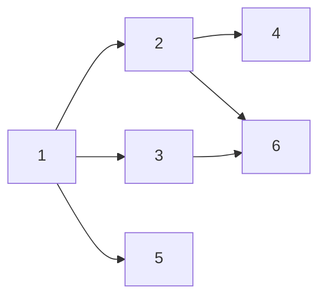
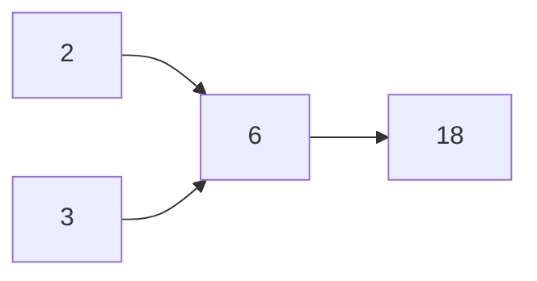

# Отношение Порядка 
Предшетствование. 

$$\displaylines{
x \text{ и } y \text{ – сравнимы, если:} \\ 
xRy \text{ или } yRx
}$$

Определение: 
1. $R$ – линейный порядок $\Leftrightarrow \forall x, y \in A$ $x$ и $y$ сравнымы. 
2. $R$ – частичный порядок $\Leftrightarrow \exists x,y \in A (x \not R y \text{ и } y \not R x)$ не сравнимы 
 
Пример (проверить): 
1. $\leq; \geq$ на $\mathbb{N}, \mathbb{Z}, \mathbb{R}$
2. $=$ на любом множестве 
3. отн. делимости на множестве $\mathbb{N}$. Не порядок на $\mathbb{Z}$, нету анти-симметричности. 
4. Отношение включения на множестве $2^{ U }$. 
5. Пусть $\leq$ – линейный порядок на множестве $A$. Тогда на $A^{ n }$ зададим покомп. сравнение. 
$$\displaylines{
A^{ n } = A \times \dots \times A \\ 
(x_{ 1 }, \dots, x_{ n }) \leq_{ n } (y_{ 1 }, \dots, y_{ n }) \Leftrightarrow 
\begin{cases}
x_{ 1 } \leq y_{ 1 }  \\
\dots \\
x_{ n } \leq y_{ n }
\end{cases}
}$$
$\leq_{ n }$ – порядок на $A^{ n }$

Пример: 
$$\displaylines{
A = \{ 0, 1 \} \\ 
A^{2} = \{ (0, 0), (0, 1), (1, 0), (1, 1) \} \\ 
(0, 1) \not\leq (1, 0) \text{ and} (1, 0) \not\leq(0, 1) \\ 
(0, 1) \text{ and } (1, 0) \text{ не сравнимы}
}$$

$\leq, \geq$ (на $\mathbb{N}, \mathbb{Z}, \mathbb{R}$) – линейный порядок

$=, \mid, \leq_{ n }$ – частичный порядок 

Пример: Лексикографический порядок. Пусть $\leq$ – это линейный порядок на множестве $A$.
$$\displaylines{
(x_{ 1 }, \dots, x_{ n }) \preceq_{ n } (y_{ 1 }, \dots, y_{ n }) \Leftrightarrow x_{ 1 } < y_{ 1 } \text{ or } \begin{cases}x_{ 1 } = y_{ 1 } \\ x_{ 2 } < y_{ 2 } \\ \text{or}\end{cases} \\
\text{лекс-гр не превосходит} \\ 
\begin{cases}
x_{ 1 } = y_{ 1 } \\
\dots \\ 
x_{ n -1 } = y_{ n - 1 } \\
x_{ n } < y_{ n }
\end{cases} \text{or}
\begin{cases}
x_{ 1 } = y_{ 1 }  \\
x_{ n } = y_{ n }
\end{cases}
}$$

Пример: 
$$\displaylines{
A = \{ 0, 1 \}, \ \ n = 2 \\ 
(0, 1) \preceq_{ 2 } (1, 0) \\
(0, 0) \preceq_{ 2 } (0, 1) \preceq_{ 2 } (1, 0) \preceq_{ 2 } (1, 1) \\ 
\preceq_{ n } \text{ – линейно порядок (проверить)}
}$$

Определение: Пусть $R$ – произвольный порядок на $A$, а $x, y \in A, \ \ x\neq y$. 
$$\displaylines{
xR^{ * }y (\text{x непосредственно предшетствует y, если } xRy \text{ и} \\ 
\not \exists z \in A, z \neq x, z \neq y, xRy, zRy) 
}$$

$R^{ * }$ не порядок. 

Пример: 
$$\displaylines{
\leq \text{ на } \mathbb{Z} \\ 
3 \leq 15 \\ 
3 \not\leq^{ * } 15 \\ 
3 \leq^{ * } 4
}$$

Пример: 
$$\displaylines{
\leq \text{ на } \mathbb{R}, \ \ \leq^{ * } = \emptyset
}$$

$A$ – конечное $\implies$ граф для $R^{ * }$ наз. диаграмой Хассе. 

Пример: $A =\{ 1, 2,3 \}, \ \ \leq$

Пример: 
$$\displaylines{
A = \{ 1, \dots, 6 \}, \ \ \mid 
}$$

Если $R$ – порядок на конечном множестве, то в диаграмме Хассе содержится вся информация об исходном порядке. 

$$\displaylines{
xR^{ * }y \Leftrightarrow xRy \text{ and } \not\exists
}$$

Теорема (о конечных упорядоченных множествах): Пусть $R$ – порядок на кон. множестве $A, x, y \in A, x\neq y, xRy$. Тогда сущ. попарно различные $z_{ 1 }, z_{ 2 }, \dots, z_{ k } \in A$ такие, что $z_{ 1 } = x, z_{ k } = y, z_{ 1 }R^{ * }z_{ 2 }, \dots, z_{ k - 1 }R^{ * }z_{ k }$.  

Если сущ. $x, y$ то от одного можно пройти к другому по непосредственной цепочке. 

Пример:
$$\displaylines{
1 \leq 5 \\ 
1 \leq^{ * } 2 \leq^{ * } 3 \leq^{ * } 4 \leq^{ * } 5
}$$

Доказательство: 
$$\displaylines{
A \text{ – конечное} \implies \text{существует конечное число цепочек, соед. x и y} \\ 
}$$
Выберем самую длинную цепочку $z_{ 1 }Rz_{ 2 }, \dots, z_{ k - 1 }R\underset{ y }{ z_{ k } }$, соед. $x$ и $y$. Докажем, что она искомая, то есть $z_{ i }R^{ * }z_{ i + 1 } \forall i = 1, \dots, k - 1$. От противного $\exists i, z_{ i }\not R^{ * }z_{ i + 1 }$ значит $\exists w \in A, w \neq z_{ i }, w\neq z_{ i + 1 }, z_{ i }Rw, wRz_{ i + 1 }$. Значит сущ. более длинная цепочка $z_{ 1 }, \dots, z_{ i }, w, z_{ i + 1 }, z_{ k }$ – более длинная цепочка. Все попарно различны. 
$$\displaylines{
\begin{matrix}
z_{ i } \cdot z_{ 1 } \\
z_{ 1 } R z_{ i }
\end{matrix} \implies z_{ 1 } = z_{ i }
}$$

Определение: Пусть $R$ – порядок на множестве $A$. $x \in A$ наз. максимальный, если $\not\exists y \in A, y\neq x, xRy$. $x \in A$ – наибольший, если все остальные элементы предшев. $x$, то есть $\forall y \in R, yRx$. $x \in A$ – минимальный, если $\not \exists y \in  A, y\neq x, yRx$. $x \in A$ – наименьший, если $\forall y \in A, xRy$. 

Пример: $A = \{ 2, 3, 6, 18 \}$. 18 – макс. и наиб. 44

