# Exercise 2.1 
## Point 1 
$$\displaylines{
A = \{ 1, 2, 3, 4, 5 \} \\ 
R_{ 1 } : aR_{ 1 }b \leftrightarrow  |a-b| = 1 \\ 
}$$
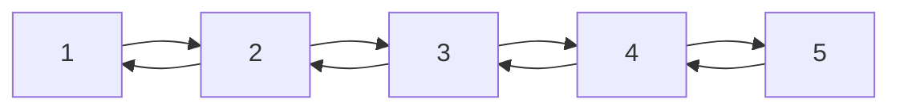
1. Not reflexive. 
2. Symmetric. 
3. Not anti-symmetric. 
4. Not transitive. 

## Point 2 
$$\displaylines{
A = \{ 1, 2, 3, 4, 5 \} \\ 
R_{ 2 } : aR_{ 2 }b \leftrightarrow  0 < a - b < 3
}$$
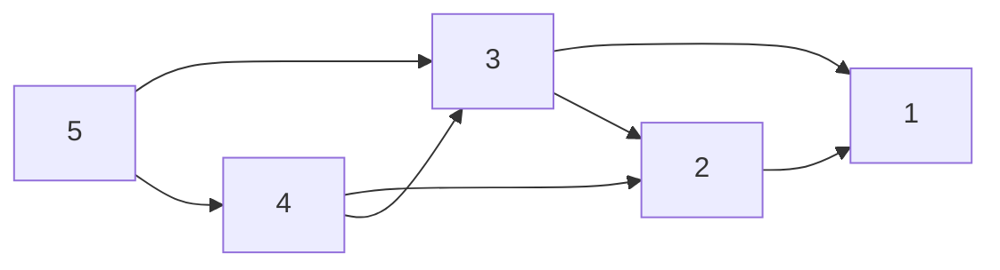
1. Not transitive. 
2. Not symmetric. 
3. Anti-symmetric. 
4. Not transitive. 

## Point 3 
$$\displaylines{
A = \{ 1, 2, 3, 4, 5 \} \\ 
R_{ 3 } : aR_{ 3 }b \leftrightarrow  \text{a + b – even number} 
}$$
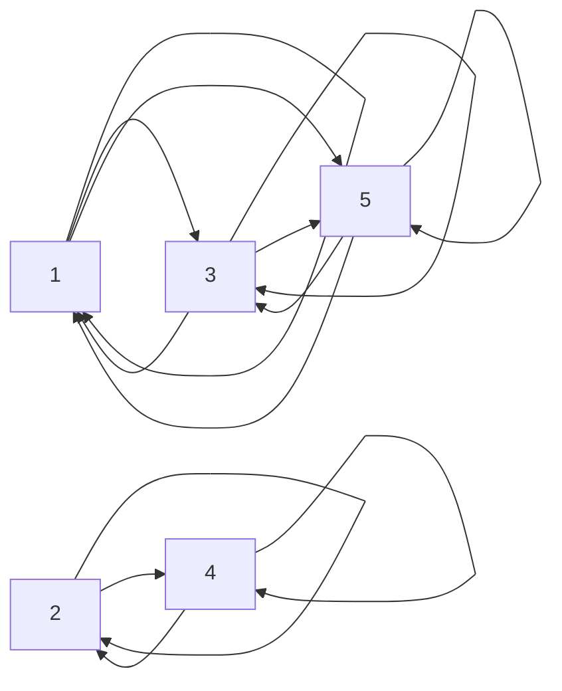
1. Transitive. 
2. Symmetric. 
3. Not anti-symmetric. 
4. Transitive. 

## Point 4 
$$\displaylines{
A = \{ 1, 2, 3, 4, 5 \} \\ 
R_{ 4 } : aR_{ 4 }b \leftrightarrow b^{2} \leq a \\
a \leq b^{2}
}$$
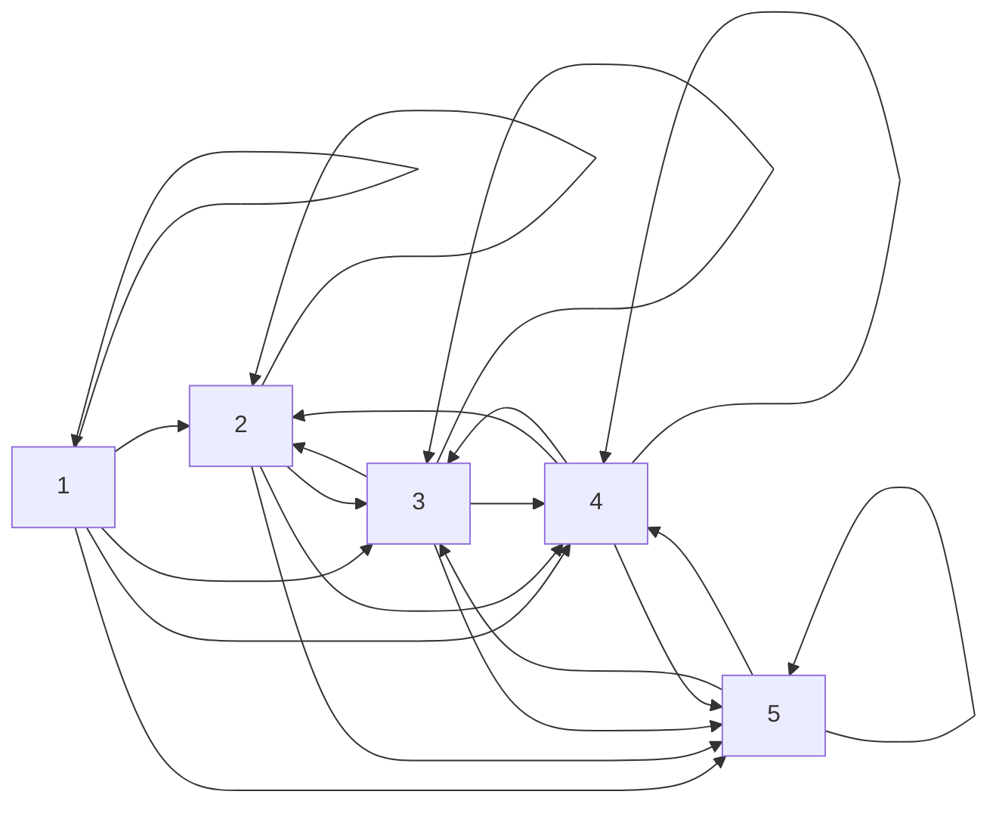
1. Reflexive. 
2. Not symmetric. 
3. Not anti-symmetric. 
4. Transitive. 

## Point 5 
$$\displaylines{
A = \{ 1, 2, 3, 4, 5 \} \\ 
R_{ 5 } : aR_{ 5 }b \leftrightarrow  \text{GCD}(a, b) = 1
}$$
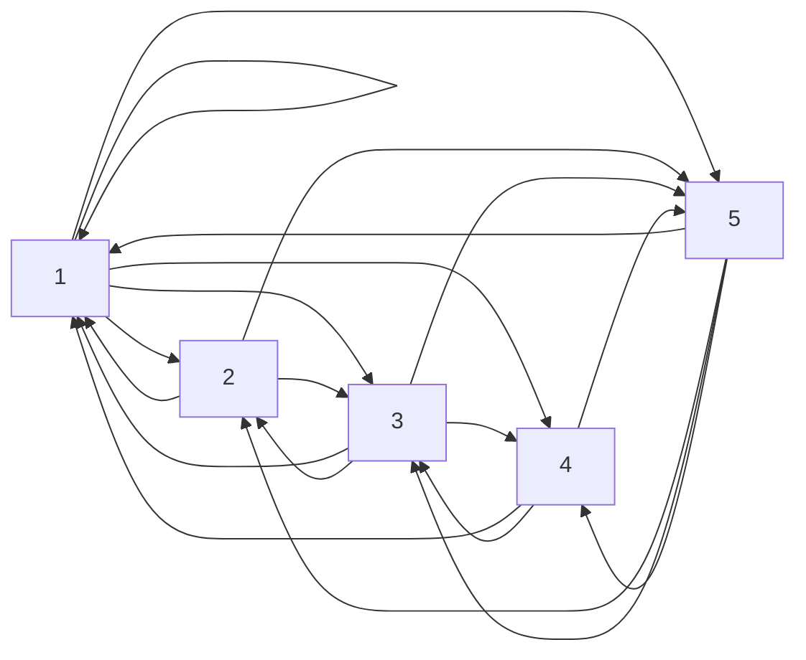
1. Not reflexive. 
2. Symmetric. 
3. Not anti-symmetric. 
4. Transitive. 

# Exercise 2.2 
## Point 1 
**Answer:** No, for example a set can be symmetric and anti-symmetric at the same time.

**Counter Example:** 
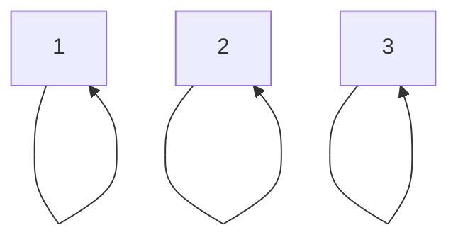

## Point 2 
**Answer:** No, a set can be symmetric and anti-symmetric at the same time.

**Counter Example:** 

## Point 3 
The relation $R \cup R^{ -1 }$ is always symmetric, because for all $(a, b) \in R$ there is $(b, a) \in R^{ -1 }$. 

The relation $R \cap R^{ -1 }$ is not always symmetric, because if $(a, b) \in R$ and $(b, a) \not\in R$, then there is no $(a, b)$ neither $(b, a)$ in $R \cap R^{ -1 }$. 

## Point 4 
The relation $R - (R \cap R^{ -1 })$ is not anti-symmetric, because there can't be a pair $(a, a)$. 
$$\displaylines{
(a, a) \in R \implies (a, a) \in R \cap R^{ -1 } \implies (a, a) \not\in R - (R \cap R^{ -1 })
}$$

## Point 5 
The relation $R_{ 1 } \cap R_{ 2 }$ is an equivalence relation, if it is reflexive, symmetric and transitive. 

**Reflexivity:** Since both $R_{ 1 }$ and $R_{ 2 }$ are reflexive, we know that $\forall a \in A, (a, a) \in R_{ 1 }$ and $\forall a \in A, (a, a) \in R_{ 2 }$, then $\forall a \in A, (a, a) \in R_{ 1 } \cap R_{ 2 }$. Hence, $R_{ 1 } \cap R_{ 2 }$ is reflexive. 

**Symmetry:** Since both $R_{ 1 }$ and $R_{ 2 }$ are symmetric, we know that $(a, b) \in R_{ 1 } \implies (b, a) \in R_{ 1  }$ and $(a, b) \in R_{ 2 } \implies (b, a) \in R_{ 2 }$.

If $(a, b) \in R_{ 1 } \cap R_{ 2 }$, then $(a, b) \in R_{ 1 }$ and $(a, b) \in R_{ 2 }$. By symmetry of $R_{ 1 }$ and $R_{ 2 }$, we know that $(b, a) \in R_{ 1 }$ and $(b, a) \in R_{ 2 } \implies (b, a) \in R_{ 1 } \cap R_{ 2 }$. 

Hence, $R_{ 1 } \cap R_{ 2 }$ is symmetric. 

**Transitivity:** Since both $R_{ 1 }$ and $R_{ 2 }$ are transitive, we know that if $(a, b) \in R_{ 1 }$ and $(b, c) \in R_{ 1 }$, then $(a, c) \in R_{ 1 }$; similarly, the same holds for $R_{ 2 }$. 

If $(a, b) \in R_{ 1 } \cap R_{ 2 }$ and $(b, c) \in R_{ 1 } \cap R_{ 2 }$, then: 
1. $(a, b) \in R_{ 1 }$, $(b, c) \in R_{ 1 }$, then $(a, c) \in R_{ 1 }$. 
2. $(a, b) \in R_{ 2 }$, $(b, c) \in R_{ 2 }$, then $(a, c) \in R_{ 2 }$. 

Therefore, $(a, c) \in R_{ 1 } \cap R_{ 2 }$. Hence, $R_{ 1 } \cap R_{ 2 }$ is transitive. 

**Answer:** The relation $R_{ 1 } \cap R_{ 2 }$ is reflexive, symmetric and transitive, then it is an equivalence relation. 

## Point 6 
The relation $R_{ 1 } \cup R_{ 2 }$ is an equivalence relation as well as $R_{ 1 } \cap R_{ 2 }$. 

# Exercise 2.3 
## Point 1
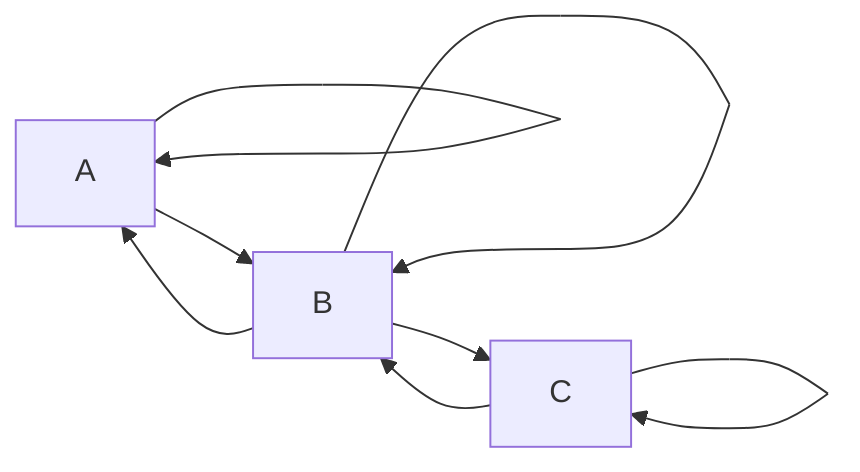

## Point 2 
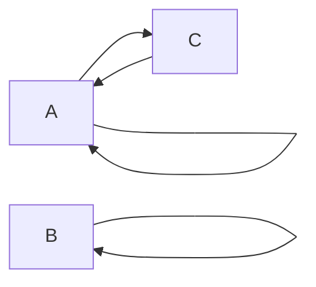

## Point 3 
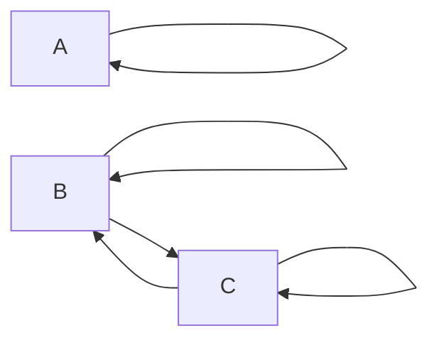

## Point 4 
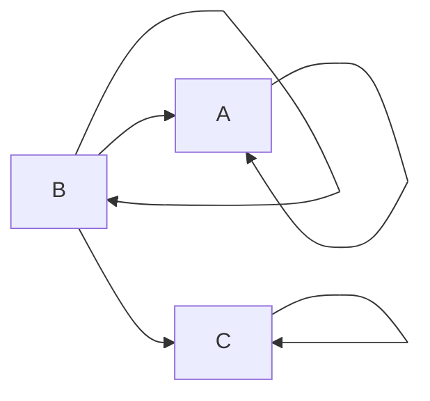

## Point 5
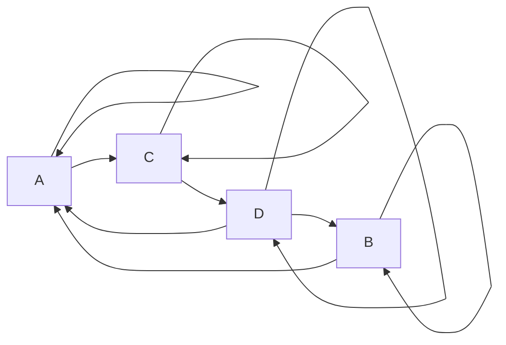

## Point 6 
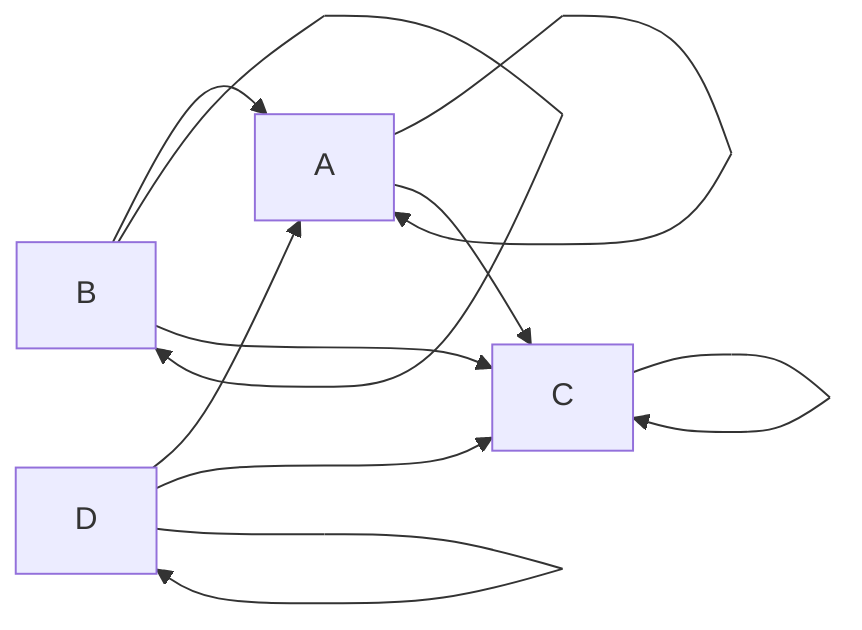

## Point 7 
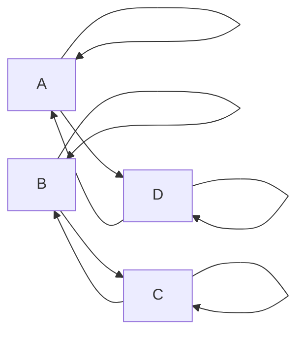

## Point 8 
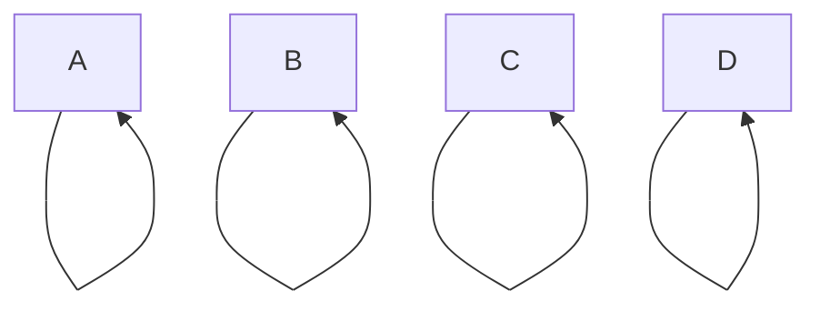
