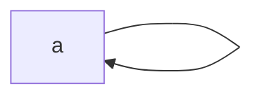
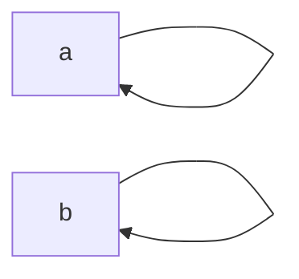
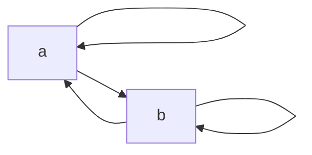
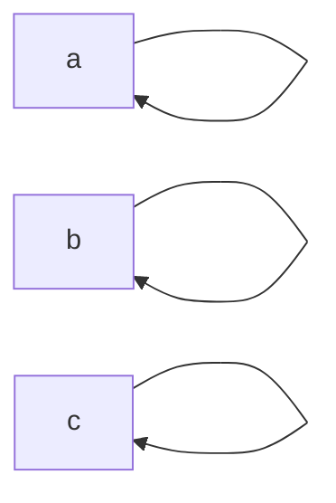
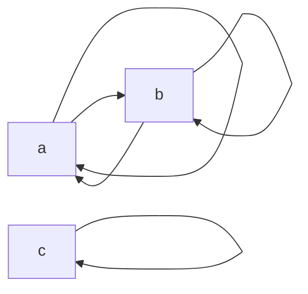

найти количество нерефлексивных, (не)транзитивных, (не)симметричных и эквивалентных отношений
# Exercise 2.4
## Point 1 
$$\displaylines{
A = \{ 0, 1, \dots, 9 \} \\ 
R : aRb \leftrightarrow a \equiv b \mod 3 \\ 
}$$

Reflexivity: For the proof we use a property $a \equiv_{ n } b \implies n \mid (a - b)$. Then $a \equiv_{ 3 } a$ means $3 \mid (a - a) \implies 3 \mid 0$ that is always true for any $a$. By the definition of $R$, this means $aRa$ is true for any $a$.   

Symmetry: For the proof we use the same property, then $a \equiv_{ 3 } b \implies 3 \mid (a - b)$ and $b \equiv_{ 3 } a \implies 3 \mid (b - a) \implies 3 \mid (a - b)$. Notations $a \equiv_{ 3 } b$ and $b \equiv_{ 3 } a$ are equivalent. By definition of $R$, this means $aRb \implies bRa$ for any $a$.  

Transitivity: Let use have $a \equiv_{ 3 } b \implies 3 \mid (a - b)$ and $b \equiv_{ 3 } c \implies 3 \mid (b - c)$. If $3 \mid (a - b)$ and $3 \mid (b - c)$, then $3 \mid ((a - b) + (b - c)) \implies 3 \mid (a - c)$. By definition of $R$, this means if $aRb$ and $bRc$, then $aRc$. 

Classes Of Equivalence: $[0, 1, 2]$

## Point 2 
$$\displaylines{
A = \{ 0, 1, \dots, 9 \} \\ 
R : aRb \leftrightarrow  a^{2} \equiv_{ 10 } b^{2}
}$$

Reflexivity: 
$$\displaylines{
a^{2} \equiv_{ 10 } a^{2} \implies 10 \mid (a^{2} - a^{2} = 0) \implies \forall a \ \ aRa
}$$

Symmetry: 
$$\displaylines{
\begin{matrix}
aRb \implies a^{2} \equiv_{ 10 } b^{2} \implies 10 \mid (a^{2} - b^{2}) \\ 
bRa \implies b^{2} \equiv_{ 10 } a^{2} \implies 10 \mid (a^{2} - b^{2}) \implies 10 \mid (b^{2}  - a^{2}) 
\end{matrix} \implies aRb \implies bRa
}$$

Symmetry:
1. Assume $aRb$. We need to prove $bRa$.
2. By definition of R: $aRb \implies a² \equiv_{ 10 } b²$  
3. By definition of congruence: $a^{2} \equiv_{ 10 } b^{2} \Leftrightarrow 10 \mid (a^{2} - b^{2})$   
5. $10 \mid (a^{2} - b^{2}) \Leftrightarrow 10 \mid -(a^{2} - b^{2})$
6. $10 \mid -(a^{2} - b^{2}) \Leftrightarrow 10 \mid (b^{2} - a^{2})$ 
7. $10 \mid (b^{2} - a^{2}) \Leftrightarrow b^{2} \equiv_{ 10 } a^{2}$ 
8. By definition of $R$: $b^{2} \equiv_{ 10 } a^{2} \implies bRa$ 

Transitivity: 
1. Assume $aRb$ and $bRc$. We need to prove $aRc$. 
2. $aRb \implies a^{2} \equiv_{ 10 } b^{2} \Leftrightarrow 10 \mid (a^{2} - b^{2})$ 
3. $bRc \implies b^{2} \equiv_{ 10 } c^{2} \Leftrightarrow 10 \mid (b^{2}- c^{2})$
4. $10 \mid (a^{2} - b^{2}), \ \ 10 \mid (b^{2} - c^{2}) \Leftrightarrow 10 \mid ((a^{2} - b^{2}) + (b^{2} - c^{2})) = (a^{2} - c^{2})$ 
5. $10 \mid (a^{2} - c^{2}) \Leftrightarrow a^{2} \equiv_{ 10 } c^{2} \Leftrightarrow aRc$ 

Classes Of Equivalence: $[0], [1], [2], [3], [4], [5], [6], [7], [8], [9]$. 

## Point 3
$$\displaylines{
A = \{ 1, 2, \dots, 9 \} \\ 
aRb \leftrightarrow  a \cdot b \equiv_{ 2 } 0 
}$$

Reflexivity: The relation $R$ is not reflexive. Counterexample: $1 \cdot 1 \cancel{ \equiv_{ 2 } } 0 \implies a\cancel{ R }a$.

## Point 4 
$$\displaylines{
A = \{ 1, 2, \dots, 9 \} \\ 
R : |2^{ a } - 2^{ b }| < 16 
}$$

Reflexivity: 
1. $aRa \Leftrightarrow |2^{ a } - 2^{ a }| \Leftrightarrow 0 < 16$ 
2. The relation $R$ is not reflexive. 

## Point 5 
$$\displaylines{
A = \{ 1, 2, \dots 9 \} \\ 
R : aRb \Leftrightarrow |2^{ a } - 2^{ b }| \leq 16
}$$

Reflexivity: 
1. $aRa \Leftrightarrow |2^{ a } - 2^{ a }| \leq 16 \Leftrightarrow 0 \leq 16$ 
2. The relation $aRa$ is reflexive. 

Symmetry: 
1. Assume $aRb$. We need to prove $bRa$. 
2. $aRb \Leftrightarrow |2^{ a } - 2^{ b }| \leq 16$ 
3. $|2^{ a } - 2^{ b }| = |2^{ b } - 2^{ a }| \implies |2^{ b } - 2^{ a }| \leq 16 \Leftrightarrow bRa$ 

Transitivity: The relation $R$ is not transitive. Counterexample: 
1. $|2^{ 1 } - 2^{ 4 }| = |2 - 16| = 14 < 16$ 
2. $|2^{ 4 } - 2^{ 5 }| = |16 - 32| = 16 \leq 16$ 
3. $|2^{ 1 } - 2^{ 5 }| = |2 - 32| = 30 > 16$ 

# Exercise 2.5
$$\displaylines{
\mathbb{Z}^{2}
}$$

## Point 1 
$$\displaylines{
R : (x_{ 1 }, y_{ 1 })R(x_{ 2 }, y_{ 2 }) \leftrightarrow  x_{ 1 } = x_{ 2 }
}$$

Reflexivity: 
1. $x_{ 1 } = x_{ 1 } \Leftrightarrow (x_{ 1 },y_{ 1 })R(x_{ 1 }, y_{ 1 })$ 

Symmetry: 
1. Assume $(x_{ 1 }, y_{ 1 })R(x_{ 2 }, y_{ 2 })$. We need to prove $(x_{ 2 }, y_{ 2 })R(x_{ 1 }, y_{ 1 })$
2. $(x_{ 1 }, y_{ 1 })R(x_{ 2 }, y_{ 2 }) \Leftrightarrow x_{ 1 } = x_{ 2 }$ 
3. $x_{ 1 } = x_{ 2 } \Leftrightarrow x_{ 2 } = x_{ 1} \Leftrightarrow (x_{ 2 }, y_{ 2 })R(x_{ 1 }, y_{ 1 })$

Transitivity: 
1. Assume $(x_{ 1 }, y_{ 1 })R(x_{ 2 }, y_{ 2 })$ and $(x_{ 2 }, y_{ 2 })R(x_{ 3 },y_{ 3 })$ 
2. $(x_{ 1 }, y_{ 1 })R(x_{ 2 },y_{ 2 }) \Leftrightarrow x_{ 1 } = x_{ 2 }$
3. $(x_{ 2 },y_{ 2 })R(x_{ 3 },y_{ 3 }) \Leftrightarrow x_{ 2 } =x_{ 3 }$ 
4. $\begin{matrix}x_{ 1 } = x_{ 2 } \\ x_{ 2 } = x_{ 3 }\end{matrix} \implies x_{ 1 } = x_{ 3 }$
5. $x_{ 1 } = x_{ 3 } \Leftrightarrow (x_{ 1 },y_{ 1 })R(x_{ 3 },y_{ 3 })$ 

Classes of Equivalence: $[(x, *)] = \{ (x, y) \mid \forall y \in \mathbb{Z} \}$

## Point 2 
$$\displaylines{
R : (x_{ 1 }, y_{ 1 })R(x_{ 2 }, y_{ 2 }) \leftrightarrow  x_{ 1 } = x_{ 2 } \text{ or } y_{ 1 } = y_{ 2 }
}$$
The relation $R$ is not transitive. Counterexample: $(1, 2)R(1, 3), \ \ (1, 3)R(4, 3) \cancel{ \implies } (1, 2)R(4, 3)$

## Point 3 
$$\displaylines{
R : (x_{ 1 }, y_{ 1 })R(x_{ 2 }, y_{ 2 }) \leftrightarrow  x_{ 1 } + y_{ 1 } = x_{ 2 } + y_{ 2 }
}$$

Reflexivity: $x_{ 1 } + y_{ 1 } = x_{ 1 } + y_{ 1 } \Leftrightarrow (x_{ 1 }, y_{ 1 })R(x_{ 1 }, y_{ 1 })$ 

Symmetry: 
1. Assume $(x_{ 1 }, y_{ 1 })R(x_{ 2 }, y_{ 2 })$. We need to prove $(x_{ 2 }, y_{ 2 })R(x_{ 1 }, y_{ 1 })$
2. $(x_{ 1 }, y_{ 1 })R(x_{ 2 }, y_{ 2 }) \Leftrightarrow x_{ 1 } + y_{ 1 } = x_{ 2 } + y_{ 2 }$
3. $x_{ 1 } + y_{ 1 } = x_{ 2 } + y_{ 2 } \Leftrightarrow x_{ 2 } + y_{ 2 } = x_{ 1 } + y_{ 1 }$
4. $x_{ 2 } + y_{ 2 } = x_{ 1 } + y_{ 1 } \Leftrightarrow (x_{ 2 }, y_{ 2 })R(x_{ 1 }, y_{ 1 })$ 

Transitivity: 
1. Assume $(x_{ 1 }, y_{ 1 })R(x_{ 2 }, y_{ 2 })$ and $(x_{ 2 }, y_{ 2 })R(x_{ 3 },y_{ 3 })$ 
2. $(x_{ 1 }, y_{ 1 })R(x_{ 2 }, y_{ 2 }) \Leftrightarrow x_{ 1 } + y_{ 1 } = x_{ 2 } + y_{ 2 }$
3. $(x_{ 2 }, y_{ 2 })R(x_{ 3 }, y_{ 3 }) \Leftrightarrow x_{ 2 } + y_{ 2 } = x_{ 3 } + y_{ 3 }$
4. $\begin{matrix}x_{ 1 } + y_{ 1 } = x_{ 2 } + y_{ 2 } \\ x_{ 2 } + y_{ 2 } = x_{ 3 } + y_{ 3 }\end{matrix} \implies x_{ 1 } + y_{ 1 } = x_{ 3 } + y_{ 3 } \implies (x_{ 1 }, y_{ 1 })R(x_{ 3 }, y_{ 3) }$

Classes Of Equivalence: ...

## Point 4 
$$\displaylines{
R : (x_{ 1 }, y_{ 1 })R(x_{ 2 }, y_{ 2 }) \leftrightarrow  x_{ 1 } + y_{ 2 } = y_{ 1 } + x_{ 2 }
}$$

Reflexive: $x_{ 1 } + y_{ 1 } = y_{ 1 } + x_{ 1 } \Leftrightarrow (x_{ 1 }, y_{ 1 })R(x_{ 1 }, y_{ 1 })$

Symmetry: 
1. Assume $(x_{ 1 }, y_{ 1 })R(x_{ 2 }, y_{ 2 })$. We need to prove $(x_{ 2 }, y_{ 2 })R(x_{ 1 }, y_{ 1 }) \Leftrightarrow x_{ 2 } + y_{ 1 } = y_{ 2 } + x_{ 1 }$   
2. $(x_{ 1 }, y_{ 1 })R(x_{ 2 }, y_{ 2 }) \Leftrightarrow x_{ 1 } + y_{ 2 } = y_{ 1 } + x_{ 2 }$  
3. $x_{ 1 } + y_{ 2 } = y_{ 1 } + x_{ 2 } \Leftrightarrow x_{ 2 } + y_{ 1 } = y_{ 2 } + x_{ 1 } \Leftrightarrow (x_{ 2 }, y_{ 2 })R(x_{ 1 }, y_{ 1 })$  

Transitivity: 
1. Assume $(x_{ 1 }, y_{ 1 })R(x_{ 2 }, y_{ 2 })$ and $(x_{ 2 }, y_{ 2 })R(x_{ 3 }, y_{ 3 })$. We need to prove $(x_{ 1 }, y_{ 1 })R(x_{ 3 }, y_{ 3 }) \Leftrightarrow x_{ 1 } + y_{ 3 } = y_{ 1 } + x_{ 3 }$ 
2. $(x_{ 1 }, y_{ 1 })R(x_{ 2 },y_{ 2 }) \Leftrightarrow x_{ 1 } + y_{ 2 } = y_{ 1 } + x_{ 2 }$
2. $(x_{ 2 }, y_{ 2 })R(x_{ 3 },y_{ 3 }) \Leftrightarrow x_{ 2 } + y_{ 3 } = y_{ 2 } + x_{ 3 }$
3. $y_{ 2 } = x_{ 2 } + y_{ 3 } - x_{ 3 }$ 
4. $x_{ 1 } + x_{ 2 } + y_{ 3 } - x_{ 3 } = y_{ 1 } + x_{ 2 } \Leftrightarrow x_{ 1 } + y_{ 3 } = y_{ 1 }$  
 
# Exercise 2.6
Число Белла. 

## Point 1
**Classes:**
$$\displaylines{
n = 1, \ \ A = \{ a \} \\ 
[a], \ \ R = \{ (a, a) \}
}$$
**Graph:** 

## Point 2
**Classes:**
$$\displaylines{
n = 2, \ \ A = \{ a, b \} \\ 
[a], \ \ [b] \\ 
[a] = [b] \\ 
R = \{ (a, a), (b, b), (b, a), (a, b) \}
}$$

**Graph 1:**

**Graph 2:**

## Point 3 
**Classes:**
$$\displaylines{
n = 3, \ \ A = \{ 1, 2, 3 \} \\ 
\{ \{ a \}, \{ b \}, \{ c \} \}, \ \ \{ \{ a, b \}, \{ c \} \}, \ \ \{ \{ a, c \}, \{ b \} \}, \ \ \{ \{ b, c \}, \{ a \} \}, \ \ \{ a, b, c\}
}$$

**Graph 1:**

**Graph 2:** 

...
