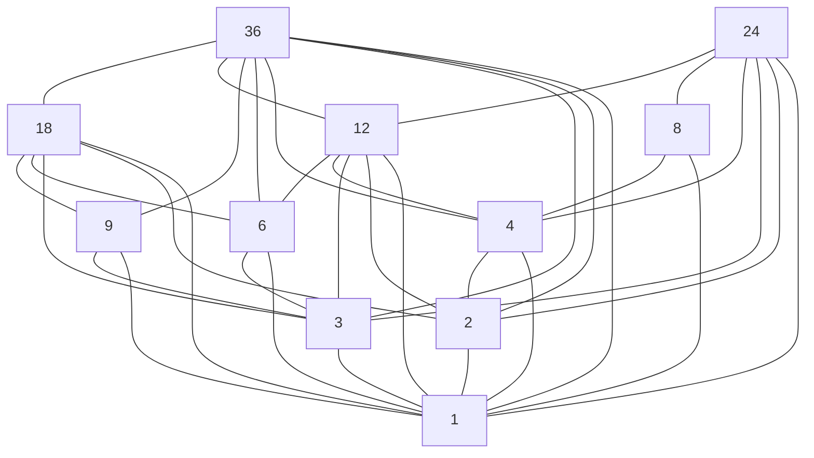
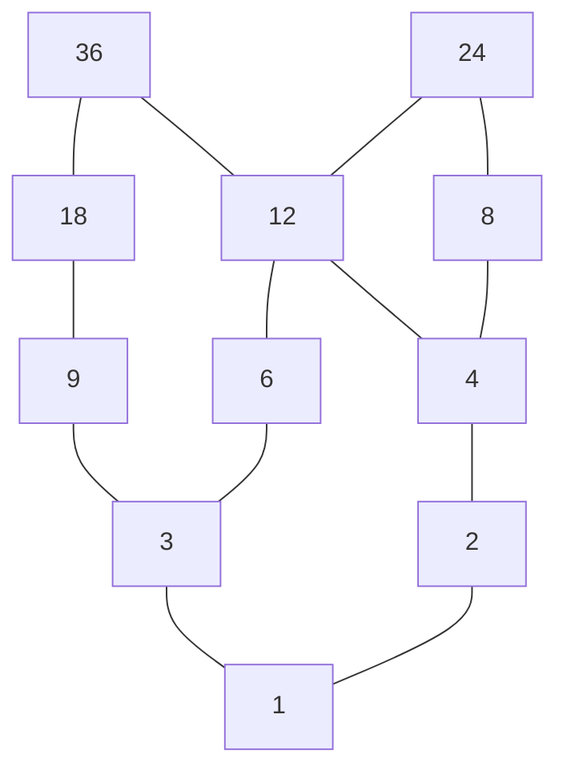
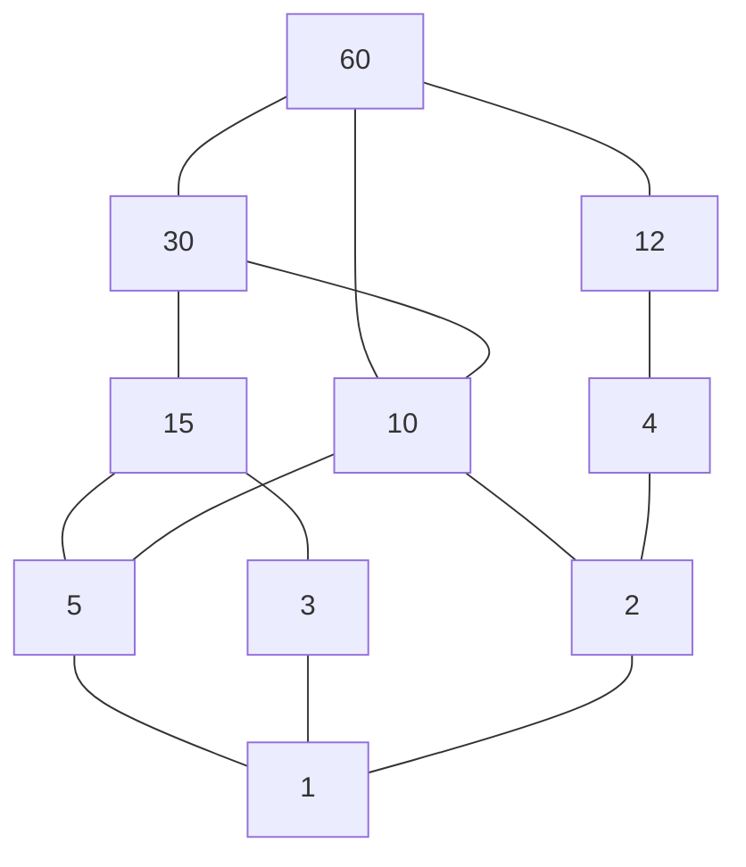
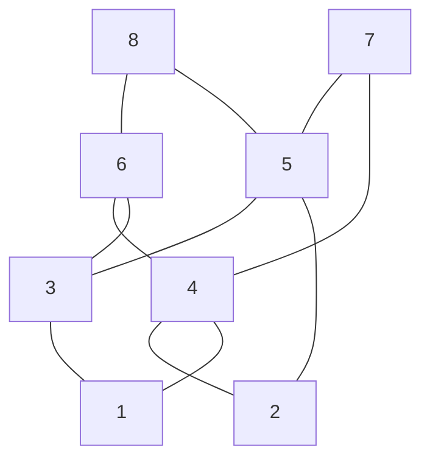

# Part 1
**Theorem:** Let $(A, R$) be an ordered set. 
1. If an element $g \in A$ is greatest, then $g$ is maximal. 
2. If an element $l \in A$ is least, then $l$ is minimal. 
3. If an element $g \in A$ is the greatest, it is the only one.
4. If an element $l \in A$ is the least, it is the only one. 
5. Every finite ordered set $A$ has at least one maximal and one minimal element. But not every set $A$ has the greatest and the least elements. 

Proof 1: Assume $g \in A$ is the greatest. If $g$ is not maximal, then $\exists b \in A, g \neq b, gRb$, which contradicts with the definition of the greatest element. 

Proof 3: Assume $g_{ 1 }, g_{ 2 } \in A$ are the greatest elements, then $g_{ 1 } R g_{ 2 } \text{ and } g_{ 2 } R g_{ 1 } \implies g_{ 1 } = g_{ 2 }$ because of the anti-symmetry. 

Proof 5: Assume $(A, R)$ is a finite ordered set. Select any element $a_{ 1 } \in A$. If $a_{ 1 }$ is not maximal, then $\exists a_{ 2 } \in A, a_{ 2 } \neq a_{ 1 }, a_{ 1 } R a_{ 2 }$. If $a_{ 2 }$ is not maximal, then $\exists a_{ 3 } \in A, a_{ 3 } \neq a_{ 2 }, a_{ 2 } R a_{ 3 }$. Continuing the process, we get a chain $a_{ 1 }, a_{ 2 }, \dots, a_{ k }$ on the step $k$. This process will end in a finite number of steps. The last step $k$ will provide us with the one of the maximal elements.

Notice that all the number $a_{ 1 }, a_{ 2 }, \dots, a_{ k }$ are not equal to each other, because it contradicts our statement about the inequality, for example, if $a_{ 3 } = a_{ 1 }$, then $a_{ 3 } R a_{ 2 }$, but we also have $a_{ 2 } R a_{ 3 }$, then $a_{ 2 } = a_{ 3 }$ which contradicts our selection of new numbers, where each new number doesn't equal to the previous one.  

# Part 2
## Exercise 2.8
**Point 1:** 
$$\displaylines{
R : aRb \leftrightarrow  a \leq b
}$$
1. Reflexivity: $\forall a \in \mathbb{Z} \implies a \leq a \Leftrightarrow aRa$. 
2. Anti-symmetry: 
	1. Assume $aRb \Leftrightarrow a \leq b$ and $bRa \Leftrightarrow b \leq a$. 
	2. $\forall a, b \in \mathbb{Z} : a \leq b  \text{ and } b \leq a \Leftrightarrow a = b$ .
3. Transitivity: 
	1. Assume $aRb \Leftrightarrow a \leq b$ and $bRc \Leftrightarrow b \leq c$. 
	2. $\forall a, b, c \in \mathbb{Z} : a \leq b \text{ and } b \leq c \implies a \leq c \Leftrightarrow aRc$ 

**Point 4:** 
$$\displaylines{
R : aRb \leftrightarrow  a^{2} \leq b^{2} 
}$$

$R$ is not anti-symmetrical:  
$$\displaylines{
a = 1 \\ 
b = -1 \\ 
1^{2} \leq (-1)^{2} \text{ and } (-1)^{2} \leq 1^{2} \implies 1 = (-1) \text{ – false}
}$$

**Point 7:** $R$ is an order relation. 

## Exercise 2.9
**Point 1:**
$$\displaylines{
\text{Set: } \{ 2, 3, 4, 6, 8, 9, 12, 18, 24, 36 \} \\ 
\text{Order Relation R: } \mid \\ 
\text{Greatest Element: –} \\ 
\text{Maximal Elements: } \{ 36, 24 \} \\ 
\text{Least Element: } 1 \\ 
\text{Minimal Element: } 1
}$$

**Point 2:**
$$\displaylines{ 
\text{Set: } \{ 1, 2, 4, 5, 10, 12, 15, 30, 60 \} \\ 
\text{Order Relation R: } \mid \\ 
\text{Greatest Element: } 60 \\ 
\text{Maximal Elements: } 60 \\ 
\text{Least Element: } 1 \\ 
\text{Minimal Element: } 1
}$$

**Point 3:**
$$\displaylines{
\text{Set: } \{ 1, 2, 3, 4, 5, 6, 7, 8 \} \\ 
\text{Order Relation R: } aRb \leftrightarrow  a = b \text{ or } a \leq b - 2 \\ 
\text{Greatest Element: –} \\ 
\text{Maximal Elements: } \{ 7, 8 \} \\ 
\text{Least Element: –} \\ 
\text{Minimal Element: } \{ 1, 2 \}
}$$

## Exercise 2.10
$$\displaylines{
(x_{ 1 }, y_{ 1 }) R (x_{ 2 }, y_{ 2 }) \leftrightarrow  x_{ 1 } \leq x_{ 2 }, y_{ 1 } \leq y_{ 2 } \\ 
(\mathbb{Z}^{2}, R) \\
}$$

**Point 1:** 
$$\displaylines{
A = \{ (x, y) : x \leq 3, y \leq 4\} \\ 

}$$

2) Номера из методички: 2.7, 2.8, 2.9, 2.10, 2.11, 2.12 (в этой задаче необходимо изобразить диаграммы Хассе, решение есть и в статье [1]).