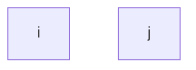
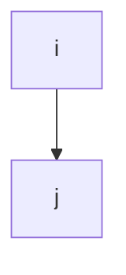
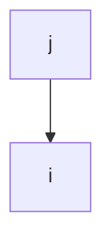

# Упражнение 3.5
Сколько бинарных отношений можно задать на множестве из $n$ элементов? Сколько среди них рефлексивных? Сколько симметричных? Сколько антисимметричных?

## Бинарные Отношения
Определение бинарного отношения: 
$$\displaylines{
R \subseteq A^{2}
}$$
Пускай множество $A$ состоит из $n$ элементов $A = \{ a_{ 1 }, a_{ 2 }, \dots, a_{ n } \}$. Тогда бинарные отношения на множестве можно описать матрицами, где единица означает, что два элемента состоят в отношениях, а ноль, означает, что два элемента в отношениях не состоят. 
$$\displaylines{
\begin{pmatrix}
 & a_{ 1 } & a_{ 2 } & \dots & a_{ n } \\
a_{ 1 } & 1/0 & 1/0 & \dots & 1/0 \\
a_{ 2 } & 1/0 & 1/0 & \dots & 1/0 \\
\dots & \dots & \dots & \dots & \dots \\
a_{ n } & 1/0 & 1/0 & 1/0 & 1/0
\end{pmatrix}
}$$

Так как матрица $n$-ого порядка, то она может принимать $n^{2}$ разных значений. Следовательно всего может быть $n^{2}$ бинарных отношений. 

## Рефлексивные Отношения
Определение Рефлексивного Отношения: 
$$\displaylines{
R \subseteq A^{2} \\ 
\forall a \in A \ \ aRa
}$$

Каждый элемент должен состоять в отношениях с самим собой, отношения с остальными элементами могут изменяться.
$$\displaylines{
\begin{pmatrix}
 & a_{ 1 } & a_{ 2 } & \dots & a_{ n } \\
a_{ 1 } & 1 & 1/0 & \dots & 1/0 \\
a_{ 2 } & 1/0 & 1 & \dots & 1/0 \\
\dots & \dots & \dots & \dots & \dots \\
a_{ n } & 1/0 & 1/0 & 1/0 & 1
\end{pmatrix}
}$$

Матрица принимает $n^{2} - n$ значений. Следовательно всего может быть $n^{2} - n$ рефлексивных отношений. 

## Симметричные Отношения
Определение Симметричного Отношения:
$$\displaylines{
R \subseteq A^{2} \\ 
\forall a, b \in A : aRb \implies bRa
}$$

... 

## Антисимметричные Отношения 
Определение Антисимметричного Отношения: 
$$\displaylines{
R \subseteq A^{2} \\ 
\forall a, b \in A : aRb, bRa \implies a = b \\ 
a \neq b \implies \begin{cases}a \not R b \\ \text{или} \\ b \not R a\end{cases}
}$$

На диагонали могут стоять как единицы, так и нули. Рефлексивные петли на антисимметричность не влияют.

**Случаи:** 

Антисимм.

Антисимм.

Антисимм.

Всего случаев: 
$$\displaylines{
2^{ n } \cdot 3^{ \frac{n^{2} - n}{2} }
}$$

# Упражнение 3.6
Дано множество 𝑈 из 𝑛 элементов и в нем подмножество 𝐴 из 𝑘 элементов. Определите число подмножеств 𝐵 ⊆ 𝑈, удовлетворяющих условию. 
$$\displaylines{
|U| = n \\ 
A \subseteq U, \ \ |A| = k
}$$

## Пункт 1
Условие:
$$\displaylines{
B \subseteq A
}$$

Число подмножеств: 
$$\displaylines{
|2^{ A }| = 2^{ |A| } = 2^{ k }
}$$

## Пункт 2
Условие: 
$$\displaylines{
A \subseteq B
}$$

Число подмножеств: 
$$\displaylines{
2^{ n - k }
}$$

## Пункт 3
Условие: 
$$\displaylines{
A \cap B = \emptyset \implies B \subseteq \overline{A}
}$$

Число подмножеств: 
$$\displaylines{
2^{ n - k }
}$$

## Пункт 4
Условие: 
$$\displaylines{
A \cap B \neq \emptyset \implies B \subseteq \overline{A}
}$$

Число подмножеств: 
$$\displaylines{
\text{Все подмножетсва - } \text{"}A \cap B = \emptyset\text{"} \implies 2^{ n } - 2^{ n - k }
}$$

## Пункт 5
Условие: 
$$\displaylines{
|A \cap B| = 1
}$$

Число подмножеств: 
$$\displaylines{
B = (n, B^{\prime}) = \{ x \} \cup B^{\prime} \text{, где } x \in A \implies k \cdot 2^{ n - k }
}$$

## Пункт 6
Условие: 
$$\displaylines{
|A \cap B| \geq 2
}$$

Число подмножеств: 
$$\displaylines{
\text{"всех"} - (A \cap B = \emptyset \text{ и } |A \cap B| = 1) = 2^{ n } - 2^{ n - k } - k \cdot 2^{ n - k }
}$$

# Упражение 8
Сколько натуральных делителей у числа 64? 81? 72? 600? 2310?

## Пункт 1
$$\displaylines{
64 = 2^{ 6 } \\ 
d \mid 2^{ 6 } \Leftrightarrow 2^{ 6 }, \ \ k = \overline{0, 6}
}$$

## Пункт 2
$$\displaylines{
81 = 3^{ 4 } \\ 
d \mid 3^{ 4 } \Leftrightarrow 3^{ k }, \ \ k = \overline{0, 4}
}$$

## Пункт 3
$$\displaylines{
72 = 8 \cdot 9 = 2^{ 3 } \cdot 3^{ 2 } \\ 
d \mid 2^{ 3 } \cdot 3^{ 2 } \Leftrightarrow d = 3^{ k } \cdot 2^{ m }, \ \ k = \overline{0, 2}, \ \ m = \overline{0, 3} \implies 12 \text{ способов} 
}$$

# Упражнение 9

$$\displaylines{
K = p_{ 1 }^{ k_{ 1 } } \cdots p_{ s }^{ k_{ s } } \\ 
d \mid K \Leftrightarrow d = p_{ 1 }^{ l_{ 1 } } \cdots p_{ s }^{ l_{ s } }, \ \ 0 \leq l_{ i } \leq k_{ i } \implies (k_{ 1 } + 1) \cdots (k_{ s } + 1) = \Pi_{ i = 1 }^{ s }(k_{ i } + 1)
}$$

# Упражнение 10

$$\displaylines{
q \cdot (q - 1) \cdots (q - 1) = q \cdot (q - 1)^{ n - 1 } 
}$$
# Упражнение 11

## Пункт 1
**Первый вариант:** Первую ладью ставим в любой место (64 позиции). Вторая ладья может стоять на (64 - 15) позициях. 
$$\displaylines{
64 \cdot (64 - 15) = 3136
}$$

**Второй вариант:** 
$$\displaylines{
(\underset{ 8 }{ x_{ 1 } }; \underset{ 7 }{ x_{ 2 } }) \mid (\underset{ 8 }{ y_{ 1 } }; \underset{ 7 }{ y_{ 2 } }) = \underbrace{ 8 \cdot 7 }_{ A_{ 8 }^{ 2 } } \underbrace{ \cdot 8 \cdot 7 }_{ A_{ 8 }^{ 2 } } = 3136 \\ 
A_{ 8 }^{ 2 } = \frac{8!}{(8 - 2)!} = \frac{6! \cdot 7 \cdot 8}{6!} = 7 \cdot 8
}$$

## Пункт 2
Первый случай (первый в угле): 
$$\displaylines{
4 \cdot 60
}$$

Второй случай (первый у стенки): 
$$\displaylines{
24 \cdot (64 - 6)
}$$

Третий случай (первый не у стенки или угла): 
$$\displaylines{
36 \cdot (64 - 9)
}$$

Всего: 
$$\displaylines{
4 \cdot 60 + 24 \cdot (64 - 6) + 36 \cdot (64 - 9) = 3612
}$$

# Пункт 3
Первый случай (первый у стенки): 
$$\displaylines{
28 \cdot (64 - 8) 
}$$

Второй случай (первый в первом внут. квадрате): 
$$\displaylines{
20 \cdot (64 - 10)
}$$

Третий случай (первый в втором внут. квадрате): 
$$\displaylines{
12 \cdot (64 - 12)
}$$

Четвертый случай (первый в третьем внут. квадрате):
$$\displaylines{
4 \cdot (64 - 14)
}$$

Всего: 
$$\displaylines{
3326
}$$

# Упражнение 14
## Пункт 1
$$\displaylines{
1, 2, \dots, n \\ 
\text{1. 1 стоит раньше 2} \ \ \underbrace{ (\dots, 1, \dots, 2, \dots) }_{ N } \\ 
\text{1. 2 стоит раньше 1} \ \ \underbrace{ (\dots, 2, \dots, 1, \dots) }_{ N } \\ 
N + N = 2N = n! \\ 
N = \frac{n!}{2}
}$$

## Пункт 2
$$\displaylines{
(1, 2, \dots, x) \ \ (n - 2)! \\ 
(x, 1, 2, \dots, x) \ \ (n - 2)! \\ 
(\dots, 1, 2) \ \ (n - 2)! \\ 
(n - 1) \cdot (n - 2)! = (n - 1)!
}$$

3.14–3.29