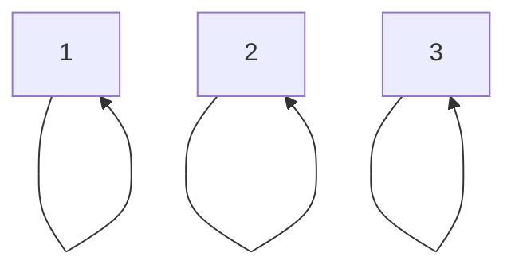

**Lemmas:**
$$\displaylines{
A = B \Leftrightarrow A \Delta B = \emptyset \\
A \subseteq B \Leftrightarrow A \cap \overline{B} = \emptyset
}$$

**Example:**
$$\displaylines{
AX = B \\ 
AX \Delta B = \emptyset \\ 
AX\overline{B} \cup \overline{AX}B = \emptyset \\ 
AX\overline{B} \cup (\overline{A} \cup \overline{X})B = \emptyset \\ 
A\overline{B}X \cup B\overline{X} \cup \overline{A}B = \emptyset \\ 
\begin{cases}
A\overline{B}X = \emptyset  \\
B\overline{X} = \emptyset \\
\overline{A}B = \emptyset
\end{cases} \Leftrightarrow 
\begin{cases}
X \subseteq \overline{A} \cup B \\
B \subseteq X  \\
\overline{A}B = \emptyset 
\end{cases} \\ 
\text{Solution:} \\ 
B \subseteq X \subseteq \overline{A} \cup B \text{, only when } \overline{A}B = \emptyset
}$$

**Exercise 1.13:**
$$\displaylines{
| 2^{ A \Delta B } - 2^{ B }| = \ ?, \ \ |A - B| = 5, \ \ |B| = 6, \ \ |AB| = 4 \\ 
|A| = 9, \ \ |A \cup B| = 11, \ \ |B - A| = 2, \ \ |A \Delta B| = 7 \\  
| 2^{ A \Delta B } - 2^{ B }| = |2^{ A \Delta B } - 2^{ (A \Delta B) \cap B }| = |2^{ A \Delta B } - 2^{ B - A }| = \\
= 2^{ |A \Delta B| } - 2^{ |B - A| } = 2^{ 7 } - 2^{ 2 } = 124
}$$

Property: 
$$\displaylines{
2^{ A } - 2^{ B } = 2^{ A } - 2^{ A \cap B }
}$$

**Example:**
$$\displaylines{
2^{ A } \cup 2^{ B } \stackrel{?}{=} 2^{ A \cup B } \\ 
\text{Let's prove: } \subseteq : \forall x \in 2^{ A } \cup 2^{ B } \text{ we need to prove that } x \in 2^{ A \cup B } \\ 
\forall x : x \in 2^{ A } \cup 2^{ B } \Leftrightarrow 
\begin{cases}
x \in 2^{ A } \\
\text{or}  \\
x \in 2^{ B }
\end{cases} \Leftrightarrow 
\begin{cases}
x \subseteq A \\
\text{or } \implies x \subseteq A \cup B  \\
x \subseteq B
\end{cases} \implies x \in 2^{ A \cup B } \\ 
\text{Vise versa: } \\
\forall x : x \in 2^{ A \cup B } \implies x \subseteq A \cup B \cancel{ \implies x \subseteq A \text{ or } x \subseteq B } 
}$$

Counter Example: 
$$\displaylines{
A = \{ 1, 2 \}, \ \ B = \{ 2, 3 \}, \ \ A \cup B = \{ 1, 2, 3 \} \\ 
2^{ A } = \{ \emptyset, \{ 1 \}, \{ 2 \}, \{ 1, 2 \} \} \\ 
2^{ B } = \{ \emptyset, \{ 2 \}, \{ 3 \}, \{ 2, 3 \} \} \\ 
2^{ A \cup B } = \{ \emptyset, \{ 1 \}, \{ 2 \}, \{ 3 \}, \{ 1, 2 \}, \{ 1, 3 \}, \{ 2, 3 \}, \{ 1, 2, 3 \} \} \\ 
|2^{ A \cup B }| = 8 \\ 
2^{ A } \cup 2^{ B } = \{ \emptyset, \{ 1 \}, \{ 2 \}, \{ 3 \}, \{ 1, 2 \}, \{ 2, 3 \} \} \\ 
}$$

**Logical Expression:**
$$\displaylines{
\forall x : P(x) \text{ or } \forall x Q(x) \neq \forall x (P(x) \text{ or } Q(x))
}$$

# Binary Relationship 
**Бинарное отношение:** Бинарное отношение $R$ на мн-ве $X$ – это $R \subseteq X \times X$  

Обозначения для $x$ находится в отношениях с $y$: 
$$\displaylines{
(x, y) \in R \Leftrightarrow xRy 
}$$

Дано $R$, можно подобрать обр-ое $R^{ -1 } = \{ (y, x) \mid (x, y) \in R \}$

Пример: 
$$\displaylines{
A = \{ 1, 2, 3, 4 \} \\ 
R  : aRb \Leftrightarrow a \leq b \\ 
\text{Перечислим элементы: } 
1. \ \ R = \{ (1, 1), (1, 2), (1, 3), (1, 4), (2, 2), (2, 3), (2, 4), (3, 3), (3, 4), (4, 4)  \} \\
2. \ \ \text{Граф.}
}$$

**Свойства бинарных отношений:**  Бинарное отношение $R$ на $A \times A$: 
$$\displaylines{
1. \text{Рефлексивность}: 
\forall x \in A \ \ xRx \\ 
2. \text{Симметричность:} \\ 
\forall x, y \text{ из того, что xRy должно следовать } yRx \\ 
3. \text{Антисимметричность:} \\ 
\forall x, y \in A : \text{ из того, что } xRy \text{ и } yRx \implies x = y\\
4. \text{Транзитивность:} \\ 
\text{xRy и yRx} \implies xRz \\ 
}$$

Симметричность и антисимметричность могут существовать одновременно. 

Док-ть антисимметричность: 
$$\displaylines{
A = \{ 1, 2, 3, 4 \} \\ 
R  : aRb \Leftrightarrow a \leq b \\ 
}$$

Записать отрицание для каждого свойства. 

Пример симметричного и антисимметричного множества: 

**Пример:**
$$\displaylines{
A = \{ 1, 2, 3, 4, 5 \} \\ 
aRb \Leftrightarrow \text{НОД(a, b) = 1} \\ 
\dots
}$$

**Пример:**
$$\displaylines{
A = \{ 1, 2, 3, 4, 5 \} \\ 
aRb \Leftrightarrow 0 < a - b < 3 \\ 
\text{1. Не симметрично.} \\ 
\text{2. Не рефл.} \\ 
\text{3. Антисемметрично} \\ 
\text{4. Не транзитивно}
}$$

**Homework:** 2.1-2.3
