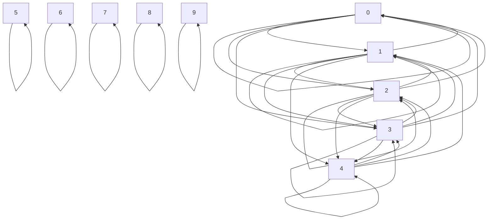

**Задача:** 
$$\displaylines{
U = \{ 0, 1, \dots, 9 \} \\ 
R_{ U } : aRb \Leftrightarrow |2^{ a } - 2^{ b }| < 16
}$$

1. ==Рефлексивно.== 
2. ==Симметрично.== 
3. Не анти-симметрично. 
4. ==Транзитивно.== 

==Является отношением эквивалентности. ==

Класс эквивалентности: 
$$\displaylines{
[a] = \{ b \mid aRb \} \\ 
[0] = \{ 0, 1, 2, 3, 4 \} = [1] = [2] = [3] \\ 
[5] = \{ 5 \} \\
[6] = \{ 6 \} \\ 
[7] = \{ 7 \} \\ 
[8] = \{ 8 \} \\ 
[9] = \{ 9 \} \\ 
U = [0] \cup [5] \cup [6] \cup [7] \cup [8] \cup [9]
}$$

**Задача 2.5:**
$$\displaylines{
(x_{ 1 }, y_{ 1 }) R (x_{ 2 }, y_{ 2 }) \leftrightarrow  x_{ 1 } = x_{ 2 } \text{ or } y_{ 1 } = y_{ 2 } \\ 
1. \ \ \forall(x_{ 1 }, y_{ 1 }) \mid (x_{ 1 }, y_{ 1 })R(x_{ 1 }, y_{ 1 }) \\ 
2. \dots \\
3. \ \ 
\begin{matrix}
(x_{ 1 }, y_{ 1 }) R (x_{ 2 }, y_{ 2 }) \\
(x_{ 2 }, y_{ 2 }) R (x_{ 3 }, y_{ 3 })
\end{matrix} \implies (x_{ 1 }, y_{ 1 }) R (x_{ 3 }, y_{ 3 }) \\ 
\text{Контрпример:} \\ 
\begin{cases}
(2, 5) R (2, 7) \\
(2, 7) R (4, 7)
\end{cases} \implies (2)
}$$

Транзитивность не выполняется. 

$$\displaylines{
(x_{ 1 }, y_{ 1 }) R (x_{ 2 }, y_{ 2 }) \Leftrightarrow x_{ 1 } + y_{ 1 } = x_{ 2 } + y_{ 2 } \\ 
1. \ \ \forall x, y \implies x + y = x + y \\ 
2. \ \ \forall 
\begin{matrix}
(x_{ 1 }, y_{ 1 }) \\
(x_{ 2 }, y_{ 2 })
\end{matrix} \ \ 
(x_{ 1 }, y_{ 1 })R(x_{ 2 }, y_{ 2 }) \implies (x_{ 2 }, y_{ 2 }) R (x_{ 1 }, y_{ 1 }) \Leftrightarrow x_{ 1 } + y_{ 1 } = x_{ 2 } + y_{ 2 } \implies x_{ 2 } + y_{ 2 } = x_{ 1 } + y_{ 2 } \\ 
3. \ \ \forall 
\begin{matrix}
(x_{ 1 }, y_{ 1 }) \\ 
(x_{ 2 }, y_{ 2 }) \\ 
(x_{ 3 }, y_{ 3 }) \\ 
\end{matrix} \ \ 
\begin{matrix}
(x_{ 1 }, y_{ 1 }) R (x_{ 2 }, y_{ 2 })  \\
(x_{ 2 }, y_{ 2 }) R (x_{ 3 }, y_{ 3 })
\end{matrix} \stackrel{ ? }{ \implies } (x_{ 1 }, y_{ 1 }) R (x_{ 3 }, y_{ 3 })
}$$

Сколько бинарных отношений в n-мерной матрице