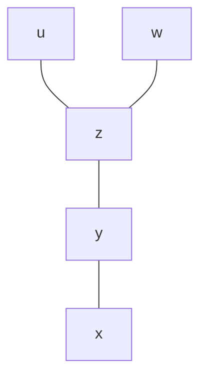
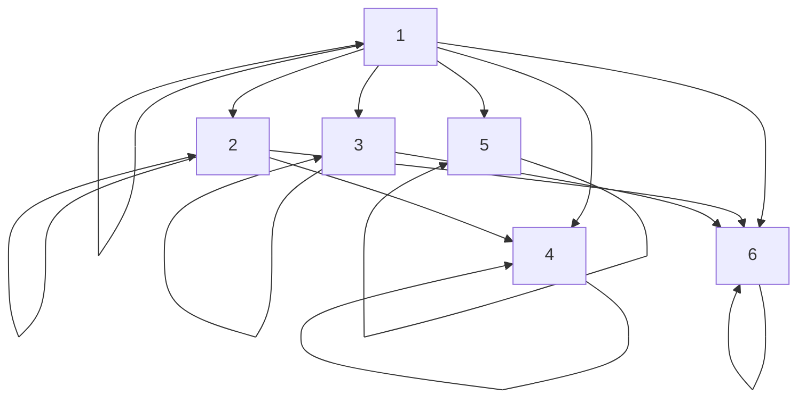
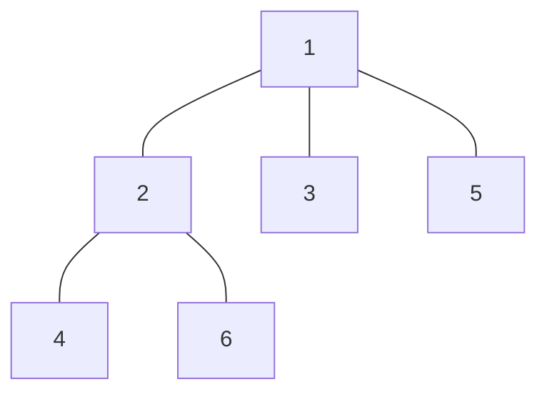

# Отношение Порядка 
**Отношение порядка:** Бинарное отношение $R$, удовл. св-ми: 
1. Рефликсивность. 
2. Анти-симметричность. 
3. Транситивность. 

**Запись:** $xRy$ "$x$ предшетствует $y$" 

**Частичный порядок:** Существуют несравнимые элементы.  
$$\displaylines{
\exists x, y \in A : x\cancel{ R }y \text{ and } y\cancel{ R }x
}$$

**Непосредственное Предшетствование:** 
$$\displaylines{
xR^{ * }y \Leftrightarrow \forall x, y \ \ \cancel{ \exists } z : xRz, \ \ zRy
}$$

**Диаграмма Хассе:** Рисуется для $R^{ * }$. 

Способы: 
1. Стрелки. 
2. Уровни. 

Пример уровней (частичный порядок, так как $u$ и $w$ не сравнимы): 

**Доказать:** Если $\exists$ наиб.(наим.) элемент, то он единственен. 

**Пример:** На множестве $A = \{ 1, 2, 3, 4, 5, 6 \}$ задано отношение делимости $xRy \Leftrightarrow x \mid y$. 

Покажем, что отношение делимости $R$  – отношение частичного порядка. 

Рефлексивность: $\forall x \ \ x \mid x  \Leftrightarrow xRx$ 

Анти-симметричность: 
1. Пусть $xRy \Leftrightarrow x \mid y$ и $yRx \Leftrightarrow y \mid x$ 
2. $x \mid y \Leftrightarrow \exists k : x = k \cdot y$ 
3. $y \mid x \Leftrightarrow \exists p : y = p \cdot x$ 
4. $p = k \Leftrightarrow x = y$ 

Транзитивность: 
1. Пусть $xRy \Leftrightarrow x \mid y$ и $yRz \Leftrightarrow y \mid z$ 
2. $\begin{matrix}x \mid y \\ y \mid z\end{matrix} \Leftrightarrow \begin{matrix}\exists k : y = k \cdot x \\ \exists p : z = p \cdot y\end{matrix} \implies xkp = z$ 

Граф: 

Граф Хассе: 

**Задача:** 
$$\displaylines{
\mathbb{Z}^{2} = \mathbb{Z} \times \mathbb{Z} \\ 
R : (x_{ 1 }, y_{ 1 }) = (x_{ 2 }, y_{ 2 }) \leftrightarrow  x_{ 1 } \leq x_{ 2 }, \ \ y_{ 1 } \leq y_{ 2 } \\ 
A = \{ (x, y) : x^{2} + y^{2} \leq 4 \} \\ 
\max : \{ (0, 2), (2, 0) , (1, 1)\} \\ 
\min : \{ (-2, 0), (-1, -1), (0, -2) \}
}$$

**Задача:**
$$\displaylines{
A = \{ (x, y) \mid x \leq 3, y \leq 4\} \\ 
\min : \emptyset \\ 
\max : (3, 4)
}$$

**Задача:** 
$$\displaylines{
A = \{ (x, y) \mid 2 \leq x + y \leq 4 \}
}$$

